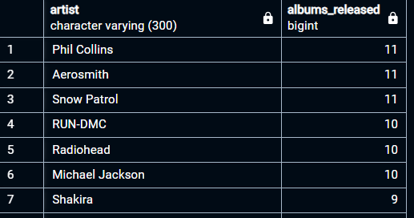

# Songs Data Analysis
___

## Description/Background
___
This project analyzes a song data to identify changes in songs attributes (e.g. loudness, duration, tempo), genre trends, etc. 
Using exploratory data analysis and visualization, the project uncovers key insights into the musical elements of songs released over a period of time.


## Table of Contents
___
- [Description/Background](#description/background)
- [About the dataset](#about-the-dataset)
- [Technologies](#technologies)
- [Data Sources](#data-sources)
- [Usage Instructions](#usage-instructions)
- [Data Cleaning and Preprocessing](#data-cleaning-and-preprocessing)
- [Data Analysis](#data-analysis)
- [Conclusion](#conclusion)

## About the dataset
___
The dataset includes various attributes of songs, such as title, artist, album, release date, duration, tempo and loudness. 

## Technologies
___
* PostgreSQL (for data cleaning, analysis, and visualisation)
* MS Excel (for data visualisation)

## Data Sources
___
Dataset was collected from a reputable music database, covering a broad period of time to provide a comprehensive look at music trends.

## Usage Instructions
___
- Data analysis can be performed on any preferred Database Management System. However, the queries in this project was written in PostgreSQL. Take note of syntax.
- Download dataset from this project repository into local machine. 
- On windows machine, enter ``` Windows + E ``` and paste the file path ```C:/ProgramData/MySQL/MySQL Server 8.0/Uploads``` on the file address to go into 'Uploads' folder.
- While in the 'Uploads' folder, create a folder named 'input_files' and copy the downloaded dataset files into this folder 
> [!CAUTION]
> You must perform the Steps above before running the SQL script.
- Open the "songs_data_analysis_queries.sql" file on your Database Management System and run the script. This should automatically create and import the dataset into a database and table.
> [!WARNING]
> Run each block of code individually for better experience.

## Data Cleaning and Preprocessing
___
* An initial query ```SELECT MIN(year_released), MAX(year_released) FROM songs_tb``` was performed to identify invalid year entry. This query returned records whose year_released had values of 0.
These records where then deleted.
* Song tempo is expected to be a positive number. Therefore, records with negative tempo value were also deleted as invalid.
* Similarly, songs with positive loudness value were deleted. Loudness of a song is expected to be a negative value. The closer the loudness of a song is to zero, the fainter it sounds.
This implies that songs with high negative values were the loudest.

## Data Analysis
___

### **1. Number of songs released yearly**

  

There was a gradual rise in the number of songs released annually.
These numbers began to increase greatly from 1987 and hit a peak in 2006
with 320 songs released in that year. This growth may be attributed
to advancements in the music industry that enabled quicker music production
with improved sound quality.

A gradual decline was observed after this peak in 2006 with a significant drop
in 2010 (65 songs). This may be attributed to the following:
- A rise in DIY production tools, encouraging artists to produce their own songs.
The lack of efficient tools for self-promotion and digital distribution may have led
to the decline in the number of songs released, leading to the rise of social media.
Hence, artists began exploring singles over full albums.
- Transition to digital music models which saw the rise of platforms 
like Spotify (launched in 2008), Apple Music, and YouTube. This encouraged
interaction between artists and fans and may have led to a focus on video contents.
- The global financial crises between 2008-2009 may have impacted production budget
and marketing support for artists in the industry.
___

### **2. Change in song tempo over time**

  

* The period between 1920 - 1955 saw a staggering drop in the tempo of songs released.
* A shift from Jazz and Swing to Crooners and Ballads could be responsible for this phenomenon.
Early jazz and swing music (1920s-1930s) was generally faster-paced, with upbeat tempos meant for dancing.  

* However, in the 1940s and 1950s, there was a shift toward crooning and ballads, popularised by singers 
like Frank Sinatra and Nat King Cole. These styles tended to have slower tempos.
* In addition, the emergence of Rhythm and Blues (R&B) in the 1940s, which often had slower, groove-oriented 
tempos may have also contributed to the decrease in tempo in mainstream music around this time.
___

### **3. Change in song loudness over time***

  

* Between 1920 and 1934, the loudness of songs released experienced a staggering increase, reaching a peak in 1934.
The introduction of new technologies such as electric microphones and amplifiers in the late 1920s, 
allowed for more dynamic sound capture and manipulation, possibly explaining why songs were louder 
between 1925 and 1935.
* In addition, magnetic tape recording became popular during this period, allowing higher fidelity and
enabling more control over volume and sound quality.
___

### **4. Top 7 Artists based on number of songs released**

  

* Phil Collins, Aerosmith, and Snow Patrol each released the highest number of albums (11 albums),
suggesting a high demand for their genre/style of music at the time - Rock (especially pop rock)
However, each artist's style varied from classic rock to blues rock and alternative rock.
___

## Conclusion
